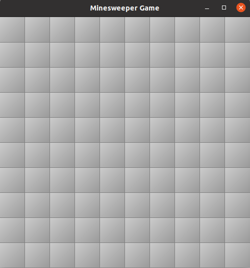
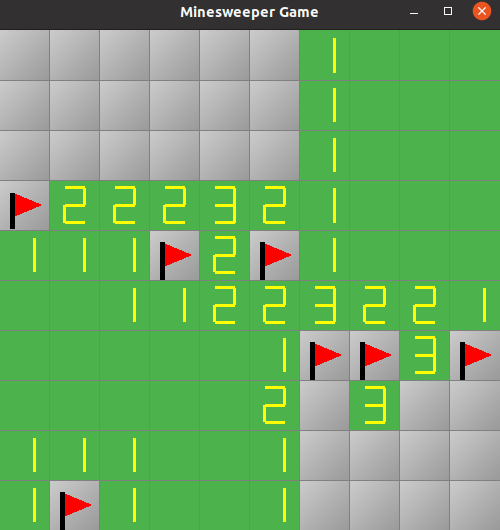
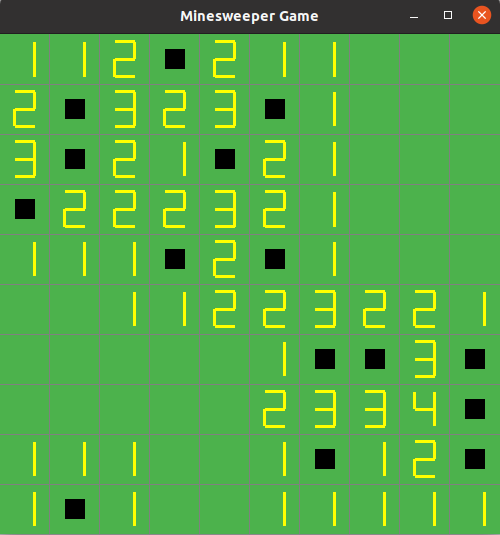

# 2DSaperOpengl

Проект представляет собой компьютерную версию классической игры "Сапёр". Игроку предоставляется игровое поле, разделенное на клетки. Некоторые из клеток содержат мины, а задача игрока - открыть все клетки, не содержащие мины, и отметить те клетки, где мины находятся.

Основные особенности:
- Реализовано отображение игрового поля с использованием графической библиотеки OpenGL.
  
- Игрок может использовать левую кнопку мыши, чтобы открывать клетки на поле, и правую кнопку мыши, чтобы отметить клетки с минами.
  
- В случае открытия клетки с миной, игра завершается, и все мины открываются, показывая игроку их расположение. После, при нажатии левой кнопки мыши игра начинается заново.
  
- При открытии пустой клетки открываются соседние пустые клетки, что упрощает процесс игры.
  
- Имеется возможность начать новую игру, как только все клетки без мин открыты.

Начало игры:

Процесс игры:

Поражение:

  
## Как установить

1. Убедитесь, что у вас установлены OpenGL, GLU и GLUT.

2. Склонируйте репозиторий

3. Соберите проект при помощи команды *make*

4. Запустите игру *./minesweeper*

5. Вы великолепны!
